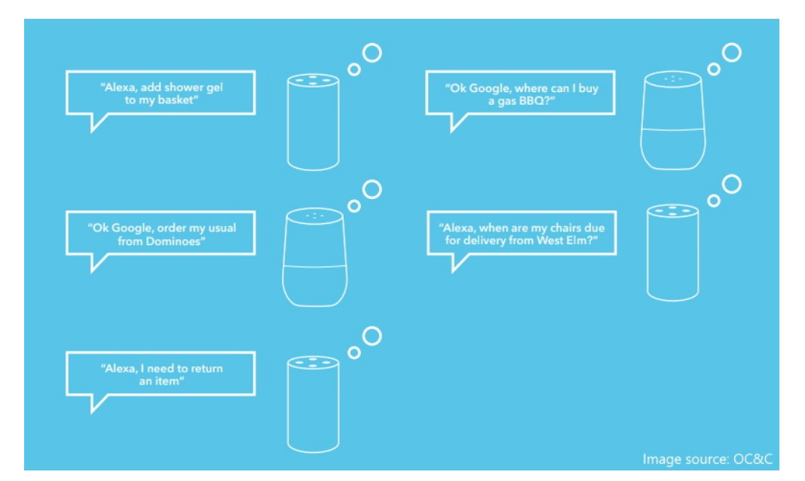
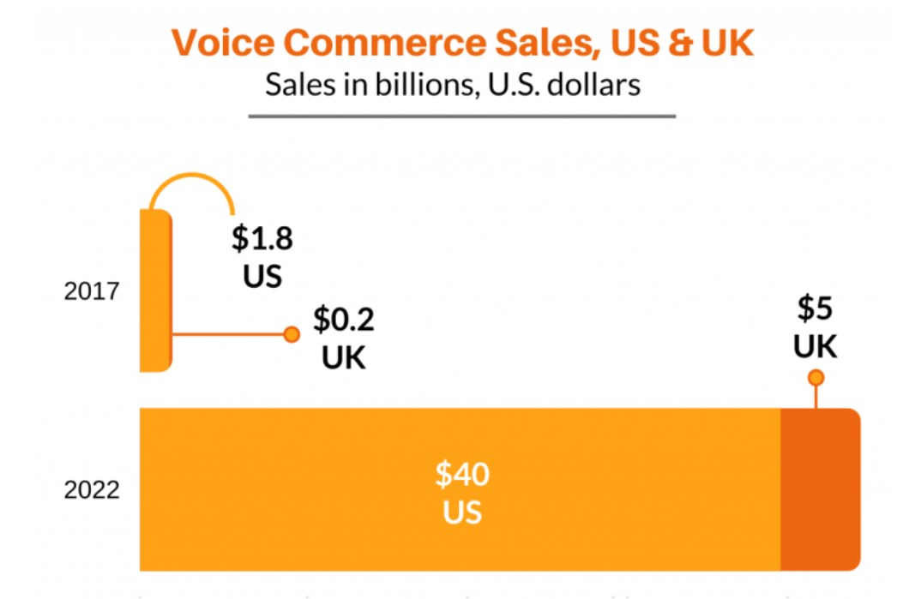
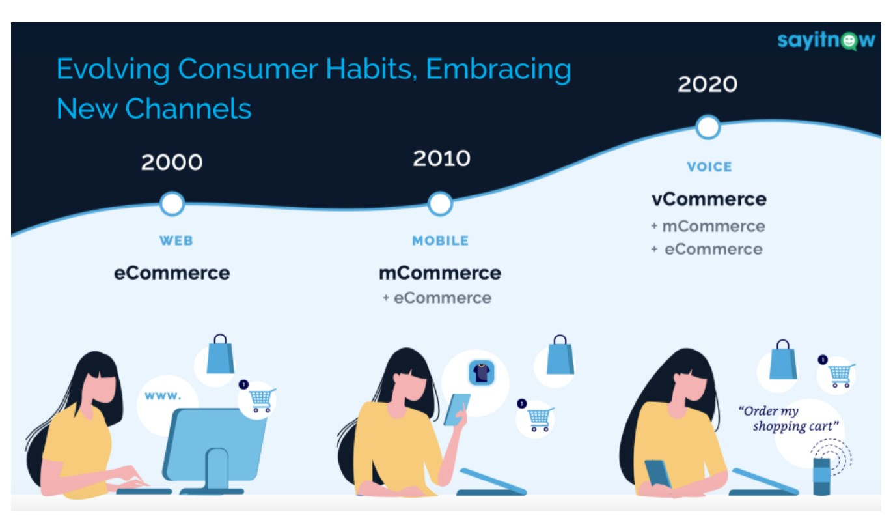
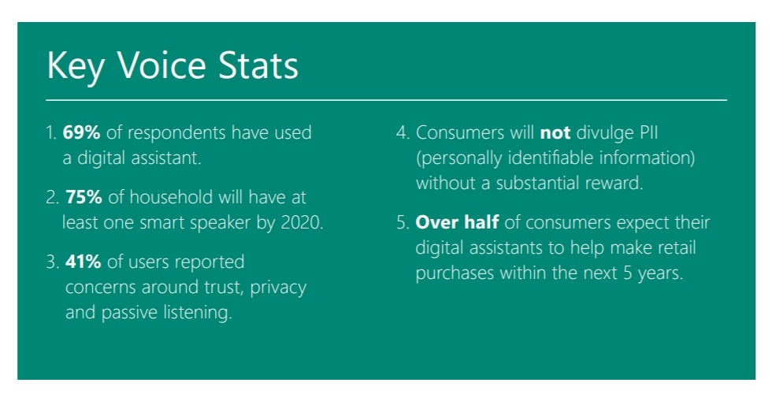

- [Definition](#definition)
- [Present state](#present-state)
- [Benefits](#benefits)
  - [Examples](#examples)
    - [Walmart](#walmart)
    - [Amazon Fresh](#amazon-fresh)
    - [Starbucks](#starbucks)
    - [Others](#others)
- [Adoption](#adoption)
- [Limitations](#limitations)
- [History](#history)
- [Development](#development)

> E-Commerce saw growth comparable to 10 years over 10 weeks during the early months of the pandemic. If this trend holds, it is estimated that online shopping would account for $158 billion in sales that would otherwise have taken place in physical retail outlets. 
> 
# Definition

Voice commerce is the use of voice commands to search for and purchase products online.

Customer interacts with a brand, and sales are made through voice recognition technology.

>Apple’s Siri, Google’s Assistant, Amazon’s Alexa, Microsoft’s Cortana

>Voice search isn’t the next big disruptor, conversational AI is.

# Present state

Overhyped or the future of commerce.

Google search stats show that in 2013, its AI could recognize 77% of spoken words. Today, that figure is 97%.

>90 million devices in the U.S.

>$40 billion voice commerce market

>global voice-based smart speaker market will be valued at $30 billion by 2024

> 25 percent of all voice queries happening on the Amazon platform, when the volume of overall search shifts toward voice Amazon becomes first and Google second
>a so called race for the future of search between the tech “giants” forges on.

>50% of all searches will be voice searches by 2020 and Voice Shopping is estimated to reach $40 Billion in U.S. by 2022

> 30% of US internet users have used a voice assistant to look for product information or purchase products

> One in 5 customers (19%) have made a voice purchase through Amazon Echo or another digital home assistant, and another  third (33%) plan to do so in the next year

>62% of voice-enabled speaker owners have bought items via voice commerce

>85% of voice shoppers have bought the first suggestion given to them on a voice search

[Voice commerce in the United States - Statistics & Facts](https://www.statista.com/topics/5406/voice-commerce-in-the-united-states/)

>By 2022, with over 18 billion IoT (Internet of Things) devices like connected cars, appliances, wearable and other consumer electronics, the potential for leveraging Voice is massive

>Online sellers will spend $7.3 billion on AI by 2022. More than 120,000 stores will be using AR technologies to offer customers a rich buying experience by 2022.

>By the end of 2021, mobile devices are expected to make almost 73% of total ecommerce sales. Besides, 30% of online shoppers are likely to abandon their carts in the middle of shopping if they find out that your website is not mobile-friendly.

>The increasing integration of voice assistants within the vehicle’s systems, not just via smartphone mirroring, will enable drivers to make eCommerce purchases from behind the wheel in a seamless way. This will drive other in-vehicle payments, including eCommerce, food and drinks to over $11 billion in 2025, from just $12 million in 2020.

[Voice-interactive devices in use to double by 2024](https://medium.com/tigrenpwa/top-15-best-examples-of-ecommerce-progressive-web-apps-in-2020-9df649e04c39)

# Benefits

Voice commerce is a great way to adapt to your customers’ changing search and shopping habits.

Providing an omnichannel experience by integrating voice with other modes of buying will lead to faster adoption of voice commerce solutions and help in increasing the customer base and revenue.

- Convenience
- Personalised experiences
- Speed of purchase
- Increased sales
- Improved competitiveness
- Broaden customer base

## Examples

### Walmart

>Walmart announced Walmart Voice Order in partnership with Google, which allows customers to order groceries with a simple, “Hey Google, talk to Walmart.”  [Ref](https://corporate.walmart.com/newsroom/2019/04/02/want-walmart-to-help-you-grocery-shop-with-our-new-voice-capabilities-just-say-the-word)

### Amazon Fresh

>AmazonFresh Expands, further leveraging Alexa for everyday voice commerce [Ref](https://voicebot.ai/2019/08/29/amazonfresh-expands-further-leveraging-alexa-for-everyday-voice-commerce)

### Starbucks

>Starbucks, which pioneered voice ordering in 2017 by allowing customers to purchase coffee and food from them using a voice assistant. In China, consumers who have the Tmall Genie speaker, created in partnership with Alibaba, can order from a nearby Starbucks and have their purchase delivered to their location.

### Others

‘Alexa, refill my prescription.’ Anthem launches voice-activated health plan assistant

Morrisons, Sainsbury's and JD Sports have built Alexa skills to enable smart speaker owners to shop their groceries or athletic gear through their device

Walmart’s Indian e-commerce subsidiary Flipkart has added voice search to its platform in English and Hindi. The new feature expands the voice search for groceries option the company introduced last June to around 150 million products.

Mobile operator Three Ireland has debuted an Alexa skill enabling customers to refill prepaid mobile phones by voice.

Nars Cosmetics is letting U.K. listeners of Spotify order product samples by talking to their smart speakers. After hearing an ad for Nars, listeners can say, "Ask 'Send Me A Sample' for Nars" to request delivery of a sample blush, lipstick or mascara from the cosmetics brand. 

# Adoption

- the boom in smart speaker adoption
- advances in voice-based AI technology
- increased demand for contactless shopping

One reason consumers fail to adopt voice commerce is consumer trust, worried that voice assistants were listening to private conversations.

[Microsoft Voice report](https://advertiseonbing-blob.azureedge.net/blob/bingads/media/insight/whitepapers/2019/04%20apr/voice-report/bingads_2019_voicereport.pdf)

Younger generation are easier to adopt, 45% of millennials use voice assistants while shopping. [Ref](https://voicebot.ai/2019/03/20/45-of-millennials-use-voice-assistants-while-shopping-according-to-a-new-study/)

Google reports that 20% of the searches in the app are done by voice.

[Voice Search Statistics](https://www.thinkwithgoogle.com/marketing-strategies/app-and-mobile/voice-search-statistics/)

>No matter where the product is being ordered from, adoption of voice commerce will grow because of the convenience this offers customers.

# Limitations

- Language
- Computerized interactions (Continuous learning, Contextual awareness)
- Knowledge gap
- Trust issues (Converse naturally)

# History

Voice Assistant – Alexa  
Release date– November 6, 2014

Assistant – Google Assistant  
Release date– May 2016

Voice Assistant – AliGenie  
Release date– July 2017

Assistant – Siri  
Release date– February 9, 2018

# Development

- Alexa Skills 
- Google Actions
- Cortana Skills
- Apple Siri Intents